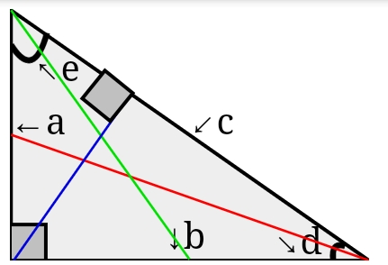

# mathematical-tools/diagonal 
a free and open source diagonal calculator 
## [demo](https://anubhavsingh0708.github.io/mathematical-tools/diagonal/)
## formula
### C or hypotenuse =
`√(a²+b²)`
#### javascript code 
```
Math.sqrt(Math.pow(a, 2)+Math.pow(b, 2));
```
### angle e =
 `sin(opposite / hypotenuse) so e = asin(b/c)` 
 #### javascript code
 ```
(Math.asin(a/c));
```
and converting it in degrees using 
```
(180/Math.PI) * (Math.asin(b/c)); 
```
### angle d=
`asin(a/c)`
#### javascript code 
the javascript code is similar to the previous 
```
(180/Math.PI) * (Math.asin(b/c)); 
```
### blue line =
sin(e°)*a
green line=√(a²+(b/2)²)

green line=√((a/2)²+b²)
